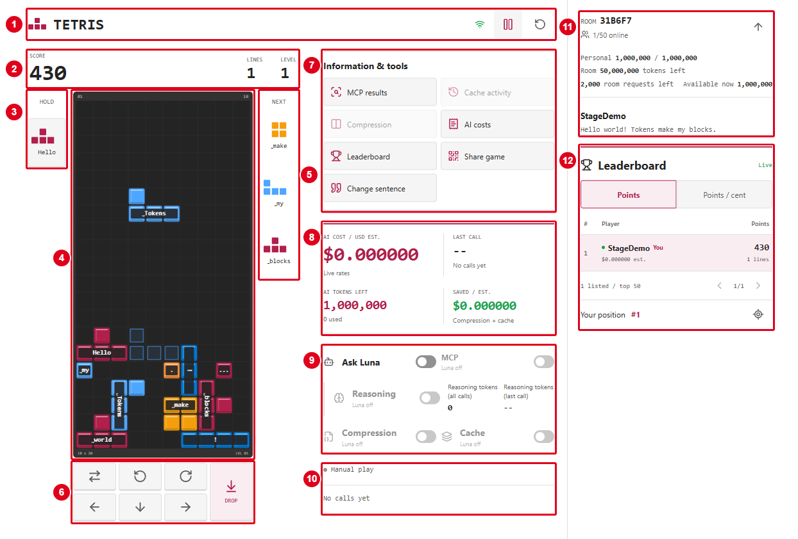

# Tetris With Luna

**Stack blocks. Clear lines. Make every token count.**

A familiar falling-block game with an AI twist: turn a sentence into your piece queue, hand the controls to GPT-5.6 Luna, and watch the token costs as it plays. Everyone gets their own board; the room shares live leaderboards.

**[Play now](https://azappctfcqc35fwl26.calmsea-c2502d80.eastus2.azurecontainerapps.io/)** | [Game rules](#game-rules) | [Screen guide](#your-screen-decoded) | [Luna controls](#let-luna-play) | [Build and host](#for-builders-and-hosts)

Here for the conference? Open the link on a laptop or phone and jump in. **Manual play and sentence previews make no model calls.** Turning on **Ask Luna** starts paid Azure AI requests.

## Play in 30 seconds

1. **Open [the game](https://azappctfcqc35fwl26.calmsea-c2502d80.eastus2.azurecontainerapps.io/).** No installation needed.
2. **Choose a distinctive name** using 2-16 letters, numbers, spaces, underscores, or hyphens.
3. **Pick your pieces:** keep **Sentence** to play your words, or choose **Classic** for a shuffled queue.
4. **Click Join game.** Move, rotate, and drop pieces to fill horizontal rows. Leave **Ask Luna** off to play yourself.

| Piece mode | What you get |
| --- | --- |
| **Sentence** | Your text is split into tokens: chunks of words, spaces, or punctuation. Each token ID maps to a shape, and that labeled sequence repeats. Try the default sentence or your own phrase, up to 500 characters and 256 tokens. The same text produces the same sequence, not necessarily a balanced mix of shapes. |
| **Classic** | A shuffled bag containing one of each of the seven shapes: I, O, T, S, Z, J, and L. A fresh bag follows when the previous one runs out. |

> **Your name is your room identity, not a secure account.** There is no password. Reusing an existing name, ignoring case and extra spaces, continues that player's best score, AI usage, and allowance and replaces their previous tab's session. Use one tab per player.

## Game rules

**The goal: score as many points as you can before the stack gets too high.**

1. **Build on a 10-column, 20-row board.** Each piece has four squares. Move it left or right and rotate it to fit the gaps.
2. **Fill a whole horizontal row to clear it.** All ten cells must be occupied. The row disappears and the blocks above it drop down. Clear several rows with one piece for more points.
3. **Keep moving.** Pieces fall automatically and lock shortly after landing. There is **no round countdown**, but this is not turn-based. Every ten cleared lines raises the level; falling speed increases up to level 20.
4. **Use your helpers.** The outlined **ghost** shows where a hard drop would land. **Next** shows the next three pieces. **Hold** saves or swaps a piece, but you can only use it once before locking another piece.
5. **Don't block the entrance.** The run ends if a new piece cannot spawn, including after a Hold swap, or if a piece locks entirely above the visible board.
6. **Try again.** **New game** resets the board, current score, lines, and level. Your best score, AI usage, and remaining allowance carry over. A fresh game always starts with Luna off.

### Controls

| Action | Keyboard | What happens |
| --- | --- | --- |
| Move | Left / Right | Slide the falling piece sideways. |
| Soft drop | Down | Move down faster, one row at a time. |
| Hard drop | Space | Drop to the ghost position and **lock immediately**. |
| Rotate clockwise | Up / X | Turn right. |
| Rotate counterclockwise | Z | Turn left. |
| Hold | C / Shift | Save the current piece, or swap it with the held one. |
| Pause / Resume | P / Escape | Pause or resume **manual play**. |

On a phone, use the buttons beneath the board; the Hold slot is also tappable. While Luna is playing, manual movement is disabled: switch **Ask Luna** off first, then press **Play** to resume manual play. If keyboard controls do not respond after editing a field, click the board.

### How points work

These are the base points for ordinary line clears at **level 1**, before drop points or bonuses:

| Rows cleared with one piece | Name | Base points |
| --- | --- | ---: |
| 1 | Single | 100 |
| 2 | Double | 300 |
| 3 | Triple | 500 |
| 4 | Tetris | 800 |

Multiply line-clear points by the level at the time of the clear. Soft drops add **1 point per row**; hard drops add **2 points per row**. Drop points are not multiplied by the level. T-spins, combos, back-to-back difficult clears, and emptying the whole board can add bonuses.

<details>
<summary>Chasing a bigger score? Bonus scoring explained</summary>

- **T-spins:** rotating a T into a tight space can register a full or mini spin. At level 1, full T-spins score 400 / 800 / 1,200 / 1,600 for zero / one / two / three cleared rows; mini spins score 100 / 200 / 400 for zero / one / two rows. These replace the ordinary clear's base points, then scale with the level.
- **Combos:** clearing lines with consecutive pieces adds `50 x combo index x level`. The first clear has index 0, the second 1, and so on. A piece that clears nothing breaks the combo.
- **Back-to-back:** after a four-line clear or a line-clearing T-spin, the next such difficult clear gets **1.5x base points**. Pieces that clear nothing preserve the chain; an ordinary one-, two-, or three-line clear breaks it.
- **Perfect clears:** emptying the board adds 800 / 1,200 / 1,800 / 2,000 points for one / two / three / four rows, multiplied by the level. A back-to-back four-line perfect clear uses 3,200 instead of 2,000.

Both piece modes use the same scoring and SRS rotation rules, including small position adjustments that let a rotation fit near a wall. The [game engine](shared/game.ts) is the source of truth.

</details>

### Two ways up the leaderboard

- **Points:** your best score across games. Manual players count too.
- **Points / cent:** your best score divided by your **cumulative estimated AI spend** in US cents, not just the cost of your latest game. Zero spend, missing prices, or incomplete usage means unranked here, not an infinite score.

Both lists show the top 50, ten players per page. Everyone in the room competes on these lists; manual and Luna-assisted runs are not separate divisions.

## Your screen, decoded

[](docs/images/screen-guide.png)

*Desktop example with Luna off and no AI tokens spent. Click the image for full size. Red numbers match the guide below; on smaller screens, the room panel moves below the game.*

| # | Area | What it does and how to use it |
| --- | --- | --- |
| **1** | **Session controls** | The connection icon shows whether you are online. Use Pause/Play for manual play; while Luna is on, the pause icon **stops Luna**. The circular arrow starts a **New game**. |
| **2** | **Score, Lines, Level** | Read your current run's points, total cleared rows, and level. Every ten lines increases the level. Your all-time room best appears in the leaderboard. |
| **3** | **Hold** | Click the slot, press **C**, or press **Shift** to save or swap a piece. It becomes available again after you lock a piece. |
| **4** | **Playfield** | This is your board. Use the keyboard or the buttons below it to place pieces; the outlined ghost previews the landing spot. In Sentence mode, blocks carry their token labels. |
| **5** | **Next** | Read the next three pieces from top to bottom and plan ahead. Sentence mode also shows the text chunks that produced them. |
| **6** | **Game controls** | Click or tap to hold, rotate, move, soft-drop, or **DROP**. Holding a movement button repeats it. DROP locks immediately, so check the ghost first. |
| **7** | **Information & tools** | Open the inspectors, costs, leaderboard, share link/QR code, or sentence editor. The button-by-button guide is below. |
| **8** | **AI cost ticker** | Watch estimated total AI cost, the last call's cost, tokens left, and estimated compression/cache savings. These track AI usage across your games, not your Tetris score. Open **AI costs** for the breakdown. |
| **9** | **Luna controls** | Enable **Ask Luna** to start continuous paid AI play. Reasoning, MCP, Compression, and Cache change how the next request works. They are off and disabled while Luna is off. |
| **10** | **Game and request status** | Check whether you are playing, paused, waiting for Luna, or retrying. After a reply, this area also summarizes the request's options and token usage. A stopped request can still be finishing. |
| **11** | **Your room and allowance** | See the room code, online count, your name/sentence, personal and shared AI balances, and remaining room requests. **Available now** also accounts for tokens held for pending or unreported requests. Use **Share game** in area 7 to invite someone. |
| **12** | **Leaderboard** | Switch between **Points** and **Points / cent**. Use the arrows to page through the top 50, or the target icon to jump to your ranking. A green dot marks an online player. |

### What's behind Information & tools?

| Button | Use it to... |
| --- | --- |
| **MCP results** | Inspect the tool call and two-placement forecasts when MCP has been used. |
| **Cache activity** | Browse received replies and see provider-confirmed cache hits, misses, writes, and instruction text. Available after a Luna reply in this tab. |
| **Compression** | Compare the exact verbose and packed prompts after a Luna reply. Called **Prompts** on phones. |
| **AI costs** | Inspect input/output usage, cache adjustments, estimated savings, and request totals. |
| **Leaderboard** | Open the rankings in a popup. Called **Scores** on phones. |
| **Share game** | Copy a credential-free join link or show a locally generated QR code for the audience to scan. |
| **Change sentence** | Edit your sentence and choose **Start with sentence** to start a fresh board. Best score and AI usage stay; Luna turns off. |

MCP results, Compression, and Change sentence suspend an enabled Luna session while open. Cache activity, AI costs, sharing, and rankings let it keep playing. **Stop Luna** remains available in the live cache and costs inspectors. Inspection itself makes no paid request.

## Let Luna play

**Ask Luna is a player, not a hint button.** Switch it on and Luna keeps choosing moves until you stop it, the game ends, or a limit/error pauses it. The board pauses while each paid request is pending, then executes the validated move. Luna can use Hold, but it can also lose. No invisible rescue bot steps in.

All four options below default off. They are **shown off and disabled whenever Ask Luna is off**; saved preferences return when you explicitly turn it back on. Changes affect the **next request**, not one already in flight.

| Option | What changes | What to watch |
| --- | --- | --- |
| **Reasoning** | Uses low reasoning effort instead of `none`. | Can take longer and use more output tokens. Reported reasoning tokens are already included in output usage. |
| **MCP** | Calls a real Model Context Protocol tool for two-placement lookahead, including Hold. | Adds input tokens and latency. Open **MCP results** to inspect its forecasts. |
| **Compression** | Losslessly packs the same board into fewer input tokens. | Open **Compression** to compare the two exact encodings. No cells are removed. |
| **Cache** | Attempts to reuse the fixed instructions. | A provider-confirmed hit can be cheaper; writes can cost extra, and hits are not guaranteed. |

**To take back the controls:** turn off **Ask Luna** or click **Stop Luna**, then use **Play** for manual play. Play buttons never start paid requests. An already-started request may still finish and be charged, but its late move will not be applied.

<details>
<summary>Pauses, retries, and returning to a game</summary>

Hidden pages, disconnects, and the MCP, compression, sentence, and local Admin dialogs suspend Luna and invalidate late moves without clearing its selection or options. Closing dialogs, returning to the page, or reconnecting to the same run can resume it. **Stop**, game over, new games, completed room resets, and page reloads leave Luna off.

**New game** and **Start with sentence** suspend Luna while awaiting confirmation. A rejected change preserves the current run and Luna selections; a successful change starts the new run with Luna off. Pending saves block new AI requests even if their dialog is closed. All **Stop Luna** buttons remain available during disconnection.

Temporary failures allow three retries with 2/4/8-second backoff or a longer server delay. Repeated failures and hard limits pause with **Retry Luna**; changing options can retry without bypassing limits. Busy/cooldown responses wait for admission without contacting the model. A stopped request is labeled **Finishing stopped request**, separately from the manual play status.

**Cache activity** retains the latest 20 received replies in the loaded page, with fixed older selections. Receipts clear on reload, but usage and cache totals persist. Provider counts do not identify individual cached words.

Rejoining with the same name and piece setup resumes a cached board if it is still available; a different setup starts a new one. A server restart loses boards, not durable scores and usage.

</details>

## Know your token budget

Each new player receives a fixed **1,000,000-token AI allowance**, shared across that player's games. Restarting or changing the sentence does **not** refill it. Previously saved players keep their stored allowance.

These are two different uses of "token":

| Token type | What it means |
| --- | --- |
| **Sentence tokens** | Choose your piece sequence. Previewing them and playing manually do not use the AI allowance. |
| **AI request tokens** | The input and output reported by the model. Both count against your allowance, including cached input. |

The room also has shared token and request limits. **AI tokens left** shows the smaller personal/room balance; **Available now** also subtracts pending holds. If AI limits stop Luna, you can still play manually.

**The cost ticker is an estimate, not an invoice.** Compression and cache can reduce costs, but a switch alone guarantees no savings. Cache reduces price, not allowance tokens.

<details>
<summary>Token accounting, pricing, and server safeguards</summary>

The personal allowance cannot be changed in the app. Balances subtract **reported input + output**, including cached input. **Available now** additionally subtracts pending reservations and a 16,000-token hold for each earlier request with unreported usage. Holds are not reported spend. MCP input and reasoning output are counted once, not added again.

The ticker uses provider usage and matching USD Global Standard short-context rates from the [Azure Retail Prices API](https://prices.azure.com/api/retail/prices), refreshed hourly. Totals are valued at the displayed rates, **not historical invoices**; stale/missing prices and incomplete usage are labeled. Pricing currently recognizes the deployment name `gpt-5.6-luna` only.

```text
ordinary input = input - cached reads - cache writes
cost = (ordinary input * input rate
      + cached reads * read rate
      + cache writes * write rate
      + output * output rate) / 1,000,000
```

**AI costs** opens the detailed breakdown, cache receipt, and request totals while the main screen retains live cost, token balance, and savings. The popup keeps Luna running and includes a Stop control. Compression savings are tokenizer estimates; cache adjustments use confirmed reads/writes. The before-optimizations estimate plus signed adjustments reconciles to reported-usage cost. Cache reduces price, not allowance tokens; enabling a switch alone saves nothing.

**Server safeguards:** one in-flight request per player, four concurrent per room, at least one second between automatic requests, 90 requests / 400,000 reserved tokens per minute, and 2,000 attempts / 50,000,000 tokens per persisted room. Busy and cooldown checks run before any prompt is built; each player's requests are evaluated at most once per second and the room evaluates at most eight per second. Each connection may send about 60 events per second (bursts of 120); sustained floods are disconnected. Each request reserves the instructions, prompt, 1,024 tokens of headroom, and its completion allowance (128 with reasoning off, 2,048 with it on), plus 2,304 tokens with MCP; there is no separate per-request cap. Provider timeouts are 20 seconds with reasoning off and 60 with it on; MCP adds a separate 15-second deadline. Invalid/truncated replies are not played, but reported usage remains charged. These are application guards, not Azure billing caps.

The room permits 50 online players and 500 saved players. At the saved-player limit, the oldest offline player with no AI usage and a score outside the top 50 is removed to make room.

</details>

## Bring it to the conference

- **Play your punchline.** Turn a phrase from the talk into a piece queue. Which words make helpful shapes, and which make trouble?
- **Human first, Luna second.** Set a manual score, start a new game, and let Luna try to beat it. Same rules; very different decision-making.
- **Follow the receipt.** Try Compression or Cache, then inspect what changed. A smaller prompt, a confirmed cache hit, and a better move are three different things.

**Hosting tip:** use **Share game** to put the QR code on screen, and test it from an audience device before the talk. It needs a public or network-accessible URL, not localhost. The room supports **50 online players**; check the shared AI budget before inviting everyone to enable Luna.

## How it works

React/Vite renders the game; Express and Socket.IO synchronize inputs against the same [game engine](shared/game.ts) on the server. Scores come from verified replay, not client-supplied totals.

Sentence mode uses real `o200k_base` token IDs, mapped to the seven shapes. Sentence text is not sent to Luna or public rankings. The AI experiment is visible: compare prompts, lookahead, provider-reported usage, and estimated cost instead of guessing what a toggle saved.

<details>
<summary>Under the hood: prompts, move validation, and real MCP</summary>

Luna alone selects a current move. [Prompt construction](server/tokens.ts) sends all **220 cells** (10 columns, 22 rows, including two hidden rows), exact active/ghost/candidate cells in `[column,row]` order, Hold, five next pieces, and every engine-generated legal placement with factual outcomes. Compression uses 22 ten-character rows; it never crops the board. The [policy](server/policy.md) and [gateway](server/model.ts) validate the returned placement ID; no substitute move or automatic rescue is used. Reasoning-off replies require a provider-confirmed zero reasoning count. Survival is not guaranteed.

[MCP lookahead](server/mcp-server.ts) uses the official SDK over stdio: initialization, `tools/list`, then `analyze_future_moves`. It replays each current candidate and enumerates next placements, including Hold, using only the known preview. The app triggers it, not the model. Forecasts are losslessly deduplicated when needed, never pruned, and must fit a 2,304-token MCP allowance. A lookup failure or an analysis that cannot fit stops before paid inference, with no silent fallback; turn off MCP for that position. The tool receives game state, not names, sentence text, session tokens, or Azure credentials.

The app starts and closes one MCP child process per lookup; no public MCP endpoint is needed. Other MCP clients can launch `npm run --silent mcp:server` from the repository. The older `lookup_board_facts` tool remains available for compatibility.

</details>

## For builders and hosts

Playing only needs a browser. Running your own room needs the setup below. Expand the section you need; the single-writer and reset warnings matter for a live audience.

<details>
<summary>Run locally, configure sharing, and understand saved data</summary>

Requires **Node.js 24+**, npm, Azure CLI, and Entra access to an existing Luna deployment (`Cognitive Services OpenAI User`). The checked-in native frontend packages target **Windows x64**; the production container runs Linux.

Use the selected `azd` environment, or set these variables for your existing resource:

```powershell
$env:AZURE_OPENAI_ENDPOINT = 'https://YOUR_RESOURCE.openai.azure.com'
$env:AZURE_OPENAI_DEPLOYMENT = 'gpt-5.6-luna'
$env:AZURE_TENANT_ID = 'YOUR_TENANT_ID'
$env:AZURE_LOCATION = 'eastus2'
az login --tenant $env:AZURE_TENANT_ID
npm ci
npm --prefix web ci
npm run build
npm start
```

Use your resource's region for `AZURE_LOCATION`; pricing needs it. Open http://127.0.0.1:3100. Local inference uses Azure CLI credentials, not API keys; leave `AZURE_CLIENT_ID` unset locally because it selects managed identity. The health endpoint `/api/health` checks the server, not successful model access.

Configuration loads the selected `azd` environment, overridden by the root dotenv file, then by process variables. See [server/config.ts](server/config.ts). `npm run dev` watches the backend; rebuild frontend edits with `npm --prefix web run build`. A second server needs a different `PORT` and `DATA_DIRECTORY`. For deliberate network sharing, set `HOST=0.0.0.0` and an audience-reachable `PUBLIC_BASE_URL`.

**Share URL override:** a saved `DATA_DIRECTORY/public-url.json` takes priority over `PUBLIC_BASE_URL`. Update its `url` field, or stop the old tunnel helper and remove the saved file to use `PUBLIC_BASE_URL`. Check the **Share game** link before distributing it. See [URL selection](server/room.ts).

### Persistence

SQLite stores the room code, hashed session credentials, sentences, best scores, allowances, and usage. Player names are unique per room. At startup, the server assigns missing name keys (for example, rows saved by an older revision) and, after verifying a backup in `DATA_DIRECTORY/backups`, merges each repeated name into its best-scoring player, combining AI usage, attempts, and allowances. Sessions of merged players end; joining with the name continues the merged player. Deploy this change with the single-writer procedure below, because an older revision that is still running can write stale usage back over a merged player. Keep backups private. Browser session credentials and options use per-tab session storage. Reload/reconnect can recover the board while its server-side game remains cached; boards are lost on process restart and can be evicted after 15 minutes disconnected. Durable scores and usage remain. Sentence text is not sent to Luna or public rankings.

</details>

<details>
<summary>Deploy to Azure: single-writer maintenance required</summary>

The existing [azure.yaml](azure.yaml), [Dockerfile](Dockerfile), and [hosting template](infra/hosting.bicep) target Azure Container Apps. Packaging requires Docker, PowerShell 7, authenticated `azd`, and the Windows frontend toolchain.

**Single writer only: maintenance downtime is required.** [Single revision mode still overlaps old and new containers during rollout](https://learn.microsoft.com/en-us/azure/container-apps/revisions#zero-downtime-deployment). One replica per revision does not protect the shared SQLite database from overlapping writers. For an app-only update:

1. Ask all players to disconnect and wait for pending Luna requests to finish.
2. Temporarily disable sticky sessions (`az containerapp ingress sticky-sessions set --affinity none` with the app name and resource group); Azure rejects Multiple revision mode while sticky sessions are enabled. Then select **Multiple** revision mode and [deactivate every active revision](https://learn.microsoft.com/en-us/azure/container-apps/revisions-manage#revision-deactivate). Wait until **all revisions have zero running replicas**. Zero traffic alone does not stop a writer.
3. Only after the old replicas have stopped, deploy:

```powershell
azd deploy web --environment tokenfall-dev --no-prompt
```

Before reopening play, verify exactly one healthy new replica and zero replicas on every older revision. Route 100% of traffic to the new revision, restore **Single** revision mode, and re-enable sticky sessions with `--affinity sticky`. For rollback, deactivate the new revision and wait for zero replicas before activating the previous one.

Do not run `azd init` over the configured environment. Provision only for intentional infrastructure changes, after `azd provision --preview`. Packaging builds the frontend on the host; the image runs non-root Node 24 on port 3100 with managed identity for registry pull and inference. Local data and credentials are excluded.

Keep one running replica, one active revision, and no traffic splitting outside maintenance. Cloud SQLite uses `DELETE` journaling / full synchronization on Azure Files. The existing SMB mount requires `nobrl` and shared-key authentication; secure transfer stays enabled. Hosting/storage charges are separate from the model ticker.

Per-address limits (join attempts and token previews) use the client address forwarded by the Container Apps ingress because the hosting template sets `TRUST_PROXY_HOPS=1`. An app-only `azd deploy` does not change container settings; apply it with a previewed `azd provision`, or add the variable to the container app. Leave it unset locally, where only loopback proxies such as the tunnel helper are trusted.

</details>

<details>
<summary>Reset room data: destructive maintenance, not New game</summary>

**A full reset deletes saved players, both leaderboards, sentences, sessions, and in-app AI history. Everyone must rejoin.** It replenishes the application allowance, not Azure billing or provider caches. Room code/link, configuration, backups, and evaluation files remain. Every applied reset verifies a recovery backup before a transactional write; keep backups private.

### Reset In The Browser

**The public Azure website does not currently have a room-reset button.** Browser resets are available only on a local development server with maintenance enabled. Admin authentication is not implemented, so the panel is off by default and must never be exposed through a tunnel or enabled on Azure.

1. Click **Admin** in **Information & tools**. It appears only when local maintenance is enabled. Opening it temporarily pauses/syncs your game and suspends Luna without changing **Ask Luna** or its selected options.
2. Select **Leaderboard + history** to remove all saved players and empty both leaderboards, or **Scores only** to clear high scores while keeping player names and AI usage. Scores only does **not** empty the leaderboard.
3. Pause all other games and wait until **Active games** and **Pending Luna requests** both show **0**.
4. Review the preview counts, then type the displayed six-character room code into **Confirm room code**.
5. Click **Clear room** for a full reset, or **Reset scores** for scores only. Wait for the success message and recovery backup name, then click **Done**.

Both modes clear current boards immediately without a server restart and leave Luna off. After a full reset, everyone must join again. **Cancel**, Close, or Escape preserves all selections and resumes Luna only if it was already enabled; manual play remains paused. Failed resets preserve the selections too. If the preview expires after two minutes or room data changes, click **Refresh reset preview** and enter the room code again.

#### Enable The Local Panel

After building/configuring the app as above, stop the local server and start it with maintenance enabled on loopback only:

```powershell
$env:LOCAL_ROOM_MAINTENANCE = 'true'
$env:HOST = '127.0.0.1'
$env:DATA_DIRECTORY = 'data\maintenance-preview'
npm start
```

Open http://127.0.0.1:3100 (or your configured port). This example uses a separate test database; it does **not** reset the public room or your usual local data. To reset an existing local room, use that server's actual `DATA_DIRECTORY`. Startup rejects public binding, production mode, or managed identity; endpoints reject non-local, forwarded, and cross-origin requests.

### Command-Line Maintenance

For a **stopped local server**, use its actual database path, preview first, then replace `YOUR01` with the displayed room code:

```powershell
npm run reset -- --database data\tokenfall.sqlite
npm run reset -- --database data\tokenfall.sqlite --apply --confirm-room YOUR01 --server-stopped
```

Restart afterward. Never pass `--server-stopped` against a running server.

For Azure, preview first and use the returned room code:

```powershell
npm run reset:azure
npm run reset:azure -- -Apply -ConfirmRoom YOUR01
```

The [Azure wrapper](scripts/reset-room.ps1) requires PowerShell 7, `az`, `azd`, and Container App exec/restart permissions. It defaults to `tokenfall-dev` (`-Environment` selects another), refuses connected players or pending AI, restarts the same revision, and verifies the result without deploying. Respect HTTP 429 cooldowns; writes are not automatically retried.

Use `--mode scores` locally or `-Mode scores` on Azure to zero scores **without removing players or AI usage**; that mode does not empty the leaderboard. See [reset implementation](scripts/reset-room.ts).

</details>

<details>
<summary>Run tests and optional paid model evaluations</summary>

```powershell
npm test
npm run build
npm --prefix web run lint
npm run test:ui
```

Tests cover replay/rules, tokenization, pricing/allowances, genuine MCP calls with synthetic inference, persistence, resets, and 50 simultaneous sockets. Browser tests require installed **Microsoft Edge** via `playwright-core`; they cover full games, Luna option gating/recovery, inspectors, QR joins, and responsive light/dark layouts. Fixtures use isolated databases and incur **no Azure inference charges**. Screenshots go to ignored `data/tetris-qa`.

Optional **paid** evaluation through the real gateway:

```powershell
node scripts\evaluate-luna.ts --live --moves 100 --min-lines 20 --max-usd 0.20 --seed pure-luna-survival-20260914
```

The [evaluator](scripts/evaluate-luna.ts) requires `--live`, keeps cache on and reasoning/MCP off, and supports `--no-compression`. It verifies exact replay and stops at its target, loss, invalid response, elapsed-time limit, or estimated spending cap. The eight-minute limit is checked between requests, not during an in-flight request. Completed, replay-verified moves have prompts, replies, and usage saved under ignored `data/luna-evaluations`, alongside the result summary. Failed requests do not have prompt/reply traces; a failure before the first verified move leaves only the error summary and database. No rescue or reset occurs. [Provider smoke checks](scripts/smoke-model.ps1) also make paid requests and are not part of normal tests. Finite passing runs do not establish indefinite survival.

</details>