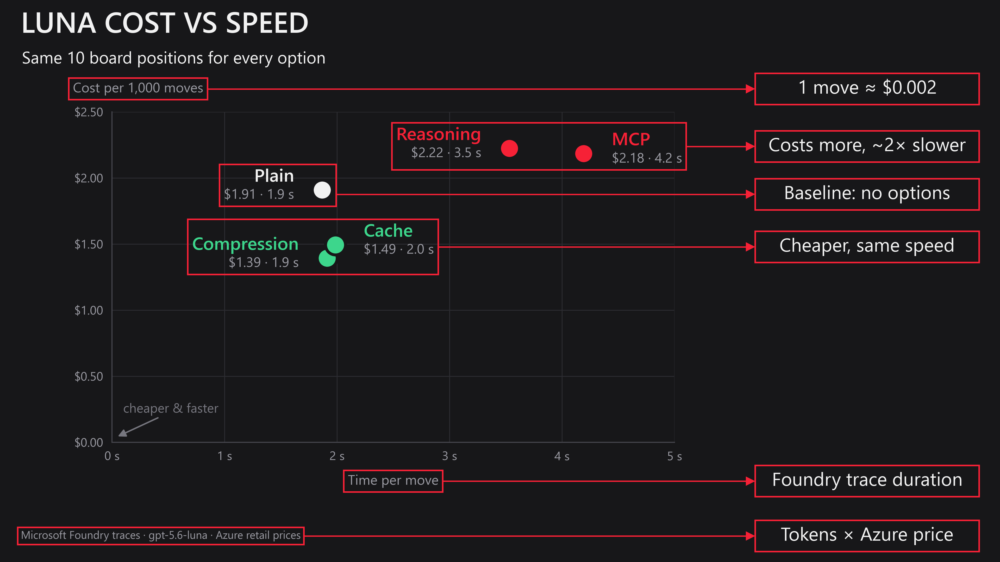

# Tetris With Luna

Tetris with sentence-generated pieces, optional GPT-5.6 Luna play, and shared leaderboards.

[Play](https://aka.ms/tokenfall) | [Workshop slides](Slides.pdf)

## Play

1. Open the game and enter a name (2-16 letters, numbers, spaces, underscores, or hyphens).
2. Choose **Sentence** for a repeating token-derived queue or **Classic** for shuffled seven-piece bags.
3. Click **Join game**. Fill horizontal rows to clear them; the run ends when a piece cannot spawn or locks entirely above the board.

[](docs/images/screen-guide.png)

After each piece locks, the score shows the points it added and how: line clears (× level from level 2), back-to-back, combos, perfect clears, and 2 points per hard-drop row or 1 per soft-drop row.


**New game** resets the board, score, lines, and level, but keeps your best score and AI usage. Luna starts off.

Names are room identities, not authenticated accounts. Reusing a name continues its scores and usage and replaces the previous tab's session. Use a distinctive name and one tab per player.

Leaderboards rank best score or best score divided by cumulative AI spend in US cents. Zero spend or incomplete cost data is unranked on **Points / cent**. Manual and AI runs share the rankings.

## Sentence mode

Text is split into `o200k_base` tokens. Each token ID maps to a shape using `token ID % 7`; the sequence repeats. Limits: 500 characters and 256 tokens. The same text always produces the same queue, not necessarily a balanced mix.

| Token ID % 7 | 0 | 1 | 2 | 3 | 4 | 5 | 6 |
| --- | --- | --- | --- | --- | --- | --- | --- |
| Shape | I | O | T | S | Z | J | L |


The example produces `Z J O I L S T L`. Sentence text is not sent to Luna or shown in public rankings.

## Controls

| Action | Key |
| --- | --- |
| Move | Left / Right |
| Soft drop | Down |
| Hard drop and lock | Space |
| Rotate clockwise | Up / X |
| Rotate counterclockwise | Z |
| Hold / swap | C / Shift |
| Pause / resume manual play | P / Escape |

Touch controls sit below the board. Hold is available once per piece. The ghost marks the hard-drop position. Click the board if keys stop responding after editing a field.

## Luna

**Ask Luna starts continuous paid Azure AI requests.** Manual play and sentence previews make no model calls. The board pauses during each request, then executes the validated move.

[](docs/images/ai-costs-luna-controls.png)

| Option | Effect |
| --- | --- |
| Reasoning | Uses low reasoning effort; may increase latency and output tokens. |
| MCP | Adds two-placement lookahead, including Hold, at additional input-token and latency cost. |
| Compression | Packs the same board into fewer input tokens without removing cells. |
| Cache | Reuses instructions when the provider confirms a hit. Writes may cost extra; hits are not guaranteed. |

Options default off, are disabled while Luna is off, and affect the next request. Saved choices return when Luna is enabled again.

[](docs/images/luna-cost-vs-speed-explained.png)

Measured from 50 [Foundry traces](#tracing) in October 2026, with each option answering the same 10 board positions at Azure retail prices. All Cache moves were cache hits. Times vary with model load.

[](docs/images/luna-mcp-cost-breakdown.png)

MCP adds 1,362 lookahead tokens per move (+14% cost) and 2.1 s of tool time.

To resume manual play, turn off **Ask Luna** or click **Stop Luna**, then **Play**. An in-flight request may still be charged, but its late move is discarded.

New players receive **1,000,000 AI tokens** across all their games. Reported input and output, including cached input, consume the allowance; restarting does not refill it. The room also has shared limits and supports 50 online players. Manual play remains available when AI limits are reached.

**AI tokens left** is the smaller personal/room balance; **Available now** also subtracts pending holds. Costs and savings are estimates, not invoices. Cache can lower price, not allowance consumption. **Information & tools** contains the prompt, cache, MCP, and cost inspectors.

## Run locally

Requires Node.js 24+, npm, Azure CLI, and Entra access to a Luna deployment (`Cognitive Services OpenAI User`). The checked-in native frontend packages target Windows x64.

Use the selected `azd` environment or configure an existing resource:

```powershell
$env:AZURE_OPENAI_ENDPOINT = 'https://YOUR_RESOURCE.openai.azure.com'
$env:AZURE_OPENAI_DEPLOYMENT = 'gpt-5.6-luna'
$env:AZURE_TENANT_ID = 'YOUR_TENANT_ID'
$env:AZURE_LOCATION = 'eastus2'
az login --tenant $env:AZURE_TENANT_ID
npm ci
npm --prefix web ci
npm run build
npm start
```

Open http://127.0.0.1:3100. Set `AZURE_LOCATION` to your resource's region for pricing. Local inference uses Azure CLI credentials; leave `AZURE_CLIENT_ID` unset because it selects managed identity.

Configuration precedence is process variables, root dotenv file, then selected `azd` environment. See [configuration](server/config.ts). `npm run dev` watches the backend; rebuild frontend changes with `npm --prefix web run build`.

When `APPLICATIONINSIGHTS_CONNECTION_STRING` is set (provisioning stores it in the `azd` environment), the local server exports [Luna traces](#tracing) with your Azure CLI identity. Set it to an empty value in the root dotenv file to keep local runs out of the shared traces.

SQLite persists scores, sentences, allowances, and usage under `DATA_DIRECTORY`. Boards are lost on server restart. A second server needs a different `PORT` and `DATA_DIRECTORY`; keep databases and backups private.

For network sharing, set `HOST=0.0.0.0` and an audience-reachable `PUBLIC_BASE_URL`. A saved `DATA_DIRECTORY/public-url.json` overrides that URL; update it or stop the old tunnel helper and remove it. Check **Share game** before distributing the link.

Rules and replay validation: [game engine](shared/game.ts). AI prompts and validation: [token handling](server/tokens.ts), [policy](server/policy.md), and [model gateway](server/model.ts).

## Deploy

[azure.yaml](azure.yaml), [Dockerfile](Dockerfile), and [hosting template](infra/hosting.bicep) configure Azure Container Apps. Packaging requires Docker, PowerShell 7, authenticated `azd`, and the Windows frontend toolchain.

**SQLite requires one writer. Deployments need downtime:** [Single revision mode overlaps old and new containers](https://learn.microsoft.com/en-us/azure/container-apps/revisions#zero-downtime-deployment).

1. Disconnect players and wait for pending Luna requests to finish.
2. Disable sticky sessions with `az containerapp ingress sticky-sessions set --affinity none` (supply the app name and resource group), switch to **Multiple** revision mode, and deactivate every active revision. Wait for **zero running replicas on every revision**; zero traffic is not enough.
3. Deploy only after the old replicas have stopped:

   ```powershell
   azd deploy web --environment tokenfall-dev --no-prompt
   ```

4. Verify one healthy new replica and zero older replicas. Route all traffic to the new revision, restore **Single** revision mode, and re-enable sticky sessions with `--affinity sticky`.

For rollback, stop the new revision and wait for zero replicas before activating the previous one. Keep one running replica, one active revision, and no traffic splitting outside maintenance.

Do not run `azd init` over the configured environment. Preview infrastructure changes with `azd provision --preview` before provisioning; app-only deployment does not update container settings. The hosting template sets `TRUST_PROXY_HOPS=1` for ingress-forwarded client addresses; leave it unset locally. Preserve Azure Files `nobrl` mounting and SQLite `DELETE` journaling/full synchronization.

## Tracing

[](docs/images/foundry-luna-traces.png)

How a Luna move reaches Foundry:

1. The [tracing module](server/tracing.ts) wraps each admitted Luna request in an `invoke_agent Luna` span. The MCP lookahead and the model call are child spans, so one move is one trace.
2. Spans follow the [OpenTelemetry GenAI conventions](https://opentelemetry.io/docs/specs/semconv/gen-ai/). Every span carries `gen_ai.agent.id` `tokenfall-luna` and the game run as `gen_ai.conversation.id`. The `chat` span records the usage the model returned.
3. Azure Monitor exports the spans with the app's managed identity to Application Insights, which is connected to the `tokenfall` Foundry project.
4. Foundry matches the spans to the linked `tokenfall-luna` agent and lists them under **Build › Agents › tokenfall-luna › Traces**.

| Span | Records |
| --- | --- |
| `invoke_agent Luna` | Options, reserved tokens, move status, and provider-reported usage |
| `execute_tool analyze_future_moves` | MCP lookahead time and result tokens, when MCP is on |
| `chat gpt-5.6-luna` | Response ID, finish reason, and input, output, cache-read, cache-write, and reasoning tokens |

Select a trace to see its spans. Set **Display mode** to **Tokens** for the token waterfall, and select the `chat` span for the input, output, cache, and reasoning tokens. Moves in one game share the conversation ID. Traces arrive within 2-5 minutes and follow the Log Analytics workspace's 30-day retention.

Link Luna once per project in [Microsoft Foundry](https://ai.azure.com): **Build › Agents › New agent › Link external agent**, with the agent name and OTel agent ID `tokenfall-luna`. [External agents](https://learn.microsoft.com/azure/foundry/agents/how-to/register-external-agent) are in preview. Without the link, traces still reach Application Insights but do not appear under **Agents**.

The [model template](infra/model.bicep) upgrades the Azure OpenAI resource in place to a Microsoft Foundry resource with the same name, endpoint, and deployment, and adds the `tokenfall` project. The [monitoring template](infra/monitoring.bicep) connects an Entra-only Application Insights resource to that project. The app, the project, and the deploying user receive `Monitoring Metrics Publisher`; the user also receives `Log Analytics Reader` and `Foundry User`.

To total usage in Application Insights:

```kusto
dependencies
| where customDimensions["gen_ai.operation.name"] == "chat"
| summarize calls = count(), input = sum(toint(customDimensions["gen_ai.usage.input_tokens"])), output = sum(toint(customDimensions["gen_ai.usage.output_tokens"])) by bin(timestamp, 1h)
```

Traces record token counts, not prompts or replies. Requests rejected before reaching Luna, such as cooldowns or exhausted budgets, are not traced. HTTP auto-instrumentation is off so health probes and Socket.IO polling do not bury the GenAI spans; occasional managed identity token requests still appear as separate traces.

## Reset room data

**Full resets delete saved players, scores, sentences, sessions, and in-app AI history. Everyone must rejoin.** Resets verify a recovery backup first and do not reset Azure billing or provider caches.

For a **stopped local server**, use its actual database path, preview, then replace `YOUR01` with the displayed room code:

```powershell
npm run reset -- --database data\tokenfall.sqlite
npm run reset -- --database data\tokenfall.sqlite --apply --confirm-room YOUR01 --server-stopped
```

Restart afterward. Never pass `--server-stopped` against a running server.

For Azure, preview first and use the returned room code:

```powershell
npm run reset:azure
npm run reset:azure -- -Apply -ConfirmRoom YOUR01
```

The [Azure wrapper](scripts/reset-room.ps1) requires PowerShell 7, `az`, `azd`, and Container App exec/restart permissions. It defaults to `tokenfall-dev`, refuses connected players or pending AI, and restarts the same revision without deploying.

Use `--mode scores` locally or `-Mode scores` on Azure to clear scores while keeping players and AI usage. The unauthenticated browser Admin panel is local-only and off by default; never expose it through a tunnel or enable it on Azure.

## Checks

```powershell
npm test
npm run build
npm --prefix web run lint
npm run test:ui
```

UI tests require Microsoft Edge. Normal tests use isolated databases and make no paid inference calls. The [live evaluator](scripts/evaluate-luna.ts) and [provider smoke checks](scripts/smoke-model.ps1) make paid requests and are not part of normal tests.
